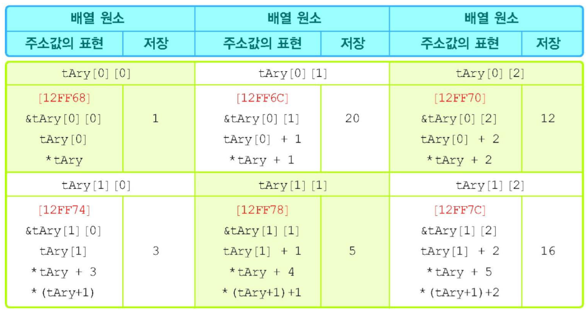

# 포인터 활용

## 포인터 변수 선언

Pointer(포인터) 변수는 메모리의 Address(주소)를 저장하는 변수이다. Pointer 변수를 선언할 때는 해당 Pointer가 가리키는 변수의 자료형을 명시해야 한다.

변수 선언 시 변수명 앞에 `*` 기호를 붙여 Pointer 변수임을 나타낸다.

``` c
int *ptr;
```

위 선언에서 각 요소의 의미는 다음과 같다.

-   `int`: Pointer 변수 `ptr`에 저장될 Address에 위치한 변수의 자료형을 의미한다.
-   `*`: `ptr`이 Pointer 변수임을 나타내는 연산자이다.
-   `ptr`: Pointer 변수의 이름이다.

따라서 변수 `ptr`은 `int` 자료형 변수를 가리키는 Pointer라고 할 수 있으며, `*ptr` 자체는 `int` 자료형 변수로 생각할 수 있다. `*`의 위치는 자료형과 변수명 사이 어디에 있어도 무방하다.

여러 개의 Pointer 변수를 한 번에 선언할 때는 각 변수명 앞에 `*`를 붙여야 한다.

-   잘못된 선언: `ptr1`만 Pointer 변수로 선언됨

    ```c
    int* ptr1, ptr2, ptr3; 
    ```

-   올바른 선언: `ptr1`, `ptr2`, `ptr3` 모두 Pointer 변수로 선언됨

    ```c
    int *ptr1, *ptr2, *ptr3; 
    ```

## 포인터 변수의 값 저장

Pointer 변수는 오직 변수의 Address 값만을 저장할 수 있다. 변수의 Address는 `&` 연산자를 사용하여 얻을 수 있다.

```c
int i = 3;
int *ptr = &i; // Pointer 변수 ptr에 변수 i의 Address를 저장 
```

위 코드에서 `ptr`은 변수 `i`의 Address 값을 가지므로, `*ptr`은 변수 `i` 자체를 의미하게 된다. 즉, `*ptr`의 값은 `i`의 값인 3과 같다.

## 역참조 연산자

Dereference operator(역참조 연산자) `*`는 Pointer 변수 앞에 붙여 사용하며, 해당 Pointer가 가리키는 메모리 공간에 저장된 값에 접근하도록 한다.

즉, Pointer 변수가 특정 변수의 Address를 저장하고 있을 때, Dereference operator를 사용하면 그 변수 자체를 참조하거나 값을 수정할 수 있다.

```c
int i = 3;
int *ptr = &i;

*ptr = i + 2; // *ptr은 변수 i를 의미하므로 i의 값이 5로 변경됨 
```

## 다중 포인터

Multiple Pointer(다중 포인터)는 다른 Pointer 변수의 Address 값을 저장하는 Pointer이다. Pointer를 위한 Pointer라고 할 수 있으며, `*`를 여러 번 사용하여 선언한다.

예를 들어 `int **dpi;`는 `int*` 타입 변수의 Address를 저장하는 이중 Pointer를 선언한 것이다.

```c
int i = 10;
int *pi = &i;      // pi는 변수 i의 Address를 저장
int **dpi = &pi;   // dpi는 Pointer 변수 pi의 Address를 저장 
```

| 변수 이름 | 저장된 값   | 가리키는 대상의 Address |
| --------- | ----------- | ----------------------- |
| `dpi`     | `pi`의 주소 | 0012FF78                |
| `pi`      | `i`의 주소  | 0012FF7C                |
| `i`       | `10`        | -                       |

Multiple Pointer를 사용하여 원본 변수의 값에 접근하려면 Dereference operator를 선언된 `*`의 개수만큼 사용해야 한다.

```c
**dpi = 20; // 변수 i의 값을 20으로 수정 
```

## 포인터 배열

Pointer Array(포인터 배열)는 각 요소가 Pointer로 구성된, 즉 Address 값을 저장하는 요소들로 이루어진 배열이다.

선언 형식은 일반 배열과 유사하며, 자료형 뒤에 `*`를 붙인다.

```c
int *pAry[3]; // int형 Pointer 3개를 요소로 갖는 배열 선언 
```

위와 같이 선언된 Pointer Array의 각 요소(`pAry[0]`, `pAry[1]`, `pAry[2]`)에는 `int`형 변수의 Address를 저장할 수 있다.

```c
int a = 10, b = 20, c = 30;
int *pAry[3] = {&a, &b, &c};
```

## 2차원 배열과 포인터

### 2차원 배열의 이름

2차원 배열에서 배열의 이름은 배열의 첫 번째 행(1차원 배열)을 가리키는 Pointer 상수(constant)이다.

예를 들어 `int tAry[2][3];`가 있을 때, 각 이름의 의미는 다음과 같다.

-   `tAry`: 배열의 첫 번째 행 `tAry[0]`를 가리키는 Pointer 상수이다. 즉, `tAry`는 Pointer를 가리키는 Pointer(이중 포인터)와 유사하게 동작한다.
-   `tAry[0]`: 배열의 첫 번째 행의 첫 번째 원소 `tAry[0][0]`의 Address 값을 갖는 Pointer 상수이다.

따라서 다음의 관계가 성립한다.

-   `tAry[0]`는 `&tAry[0][0]`와 같다.
-   `*tAry`는 `tAry[0]`와 같다.
-   결론적으로 `**tAry`는 `*tAry[0]`와 같으며, 이는 `tAry[0][0]`의 값이다.

### 2차원 배열의 구조

`int tAry[2][3] = {{1, 20, 12}, {3, 5, 16}};` 배열의 메모리 구조는 다음과 같이 개념적으로 표현할 수 있다.



### sizeof 연산

`sizeof` 연산자를 2차원 배열에 사용하면 각 부분이 나타내는 크기를 확인할 수 있다.

```c
int tAry[2][3] = {{1, 20, 12}, {3, 5, 16}};
```

-   `sizeof(tAry)`: 전체 배열의 크기. `2 * 3 * sizeof(int)` = 24바이트.
-   `sizeof(tAry[0])`: 하나의 행(1차원 배열)의 크기. `3 * sizeof(int)` = 12바이트.
-   `sizeof(tAry[0][0])`: 원소 하나의 크기. `sizeof(int)` = 4바이트.

### 배열 포인터 연산

Pointer의 성질을 이용하면 Pointer 연산을 통해 2차원 배열의 원소에 접근할 수 있다.

-   `tAry[0] + 1`: 첫 번째 행의 두 번째 원소(`tAry[0][1]`)의 Address를 의미한다.
    -   `*(tAry[0] + 1)`은 `tAry[0][1]`의 값인 20이다.
-   `tAry + 1`: 두 번째 행(`tAry[1]`)의 시작 Address를 가리키는 Pointer를 의미한다.
    -   `*(tAry + 1)`은 `tAry[1]`과 같으며, 이는 `&tAry[1][0]`이다.
    -   `**(tAry + 1)`은 `*tAry[1]`과 같으며, 이는 `tAry[1][0]`의 값인 3이다.

### 2차원 배열 원소 표현

2차원 배열의 원소 `tAry[i][j]`는 Pointer를 이용하여 다양하게 표현할 수 있다.

-   `*(tAry[i] + j)`
-   `*(*(tAry + i) + j)`
-   `(*(tAry + i))[j]`

이 표현들은 1차원 배열에서 `a[i]`가 `*(a + i)`와 같다는 규칙을 확장한 것이다.

아래 표는 **`tAry[0][0]`의 Address**를 나타내는 다양한 표현이다.

| 표현 방식     |
| ------------- |
| `&tAry[0][0]` |
| `tAry[0]`     |
| `*tAry`       |

## 함수 포인터

Function Pointer(함수 포인터)는 특정 함수의 시작 Address를 저장하는 변수이다. 이를 통해 함수를 간접적으로 호출할 수 있다.

Function Pointer를 선언할 때는 가리키게 될 함수의 반환값 유형과 매개변수 목록(타입, 개수, 순서)이 일치해야 한다.

```c
// 반환값이 void이고, 3개의 double 타입 매개변수를 갖는 함수
void add(double *z, double x, double y);

// 위 함수를 가리킬 수 있는 Function Pointer 'pf' 선언
void (*pf)(double*, double, double); 
```

선언 시 `(*pf)`와 같이 Pointer 변수명을 괄호로 묶어야 한다. 괄호가 없으면 `void*` 타입을 반환하는 함수 `pf`를 선언하는 의미가 되므로 주의해야 한다.

Function Pointer의 사용법은 다음과 같다.

```c
double result, m, n;
pf = add; // Function Pointer pf에 add 함수의 Address를 할당 
pf(&result, m, n); // pf를 통해 add 함수를 호출 
```

## 함수 포인터 배열

함수 포인터 배열은 Function Pointer를 원소로 갖는 배열이다. 동일한 반환값 유형과 매개변수 목록을 가진 여러 함수를 배열로 관리하고 싶을 때 유용하다.

```c
// 반환값이 void이고 매개변수가 (double*, double, double)인 함수를
// 가리키는 Function Pointer 4개를 저장하는 배열 pfary 선언
void (*pfary[4])(double*, double, double); 
```

배열 선언과 동시에 함수의 Address로 초기화할 수 있다.

```c
// add, subtract, multiply, divide는 미리 선언된 함수라고 가정
void (*pfary[4])(double*, double, double) = {add, subtract, multiply, devide}; 
```

배열의 각 원소는 해당 함수를 가리키므로, 반복문 등을 통해 함수를 효율적으로 호출할 수 있다.

```c
for(int i = 0; i < 4; i++) {
    pfary[i](&result, m, n); // 배열의 i번째 원소가 가리키는 함수 호출 
}
```