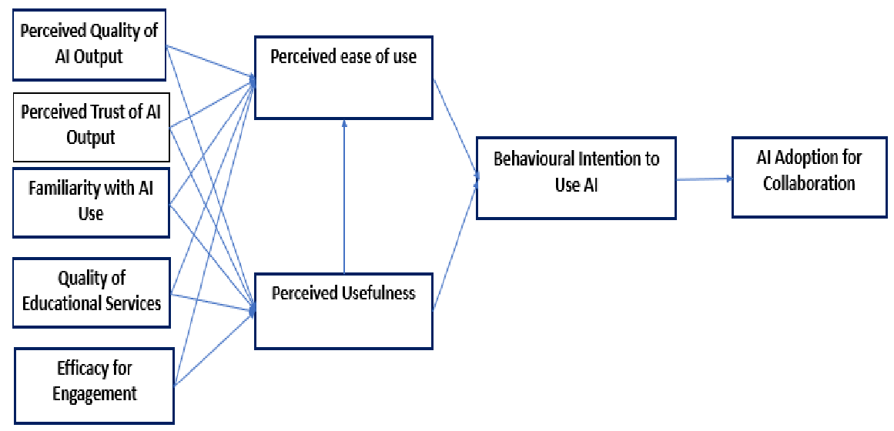
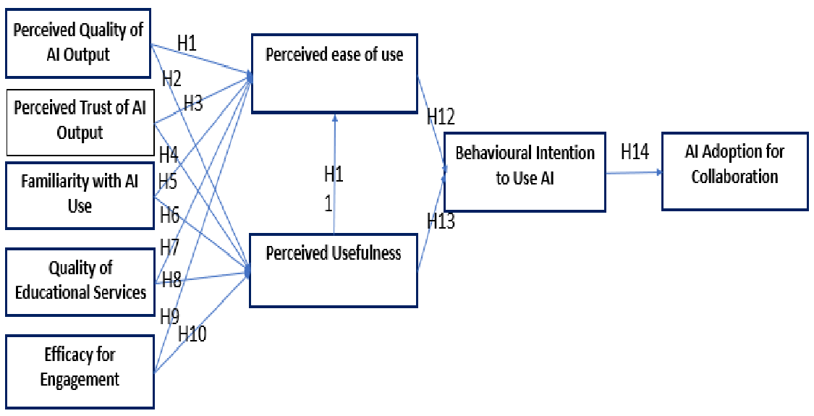

# AI Adoption for Collaboration: Factors Influencing Inclusive Learning Adoption in Higher Education

## 논문 정보

-   저자 (Authors):

     Ibrahim Youssef Alyoussef, Amr Mohammed Drwish, Fatimah Adel Albakheet, Rafdan Hassan Alhajhoj, Amal Ahmed Almousa

    -   소속 (Affiliations): Education Technology, Faculty of Education, King Faisal University, Al-Ahsa 31982, Saudi Arabia
    -   교신 저자 (Correspondence): Ibrahim Youssef Alyoussef (ialyoussef@kfu.edu.sa)

-   학술지 (Journal): IEEE Access (게재 승인 상태, 정식 편집 전 저자 버전)

-   게재 예정일 (Date of publication): 미정 (xxxx 00, 0000으로 표기됨)

-   DOI: 10.1109/ACCESS.2025.3567656 (게재 예정 DOI로 보임)

-   키워드 (Index Terms): 인공지능(Artificial intelligence), AI 채택(AI adoption), 협업(Collaboration), 포용적 학습(Inclusive Learning), 고등 교육(Higher education), 기술 수용(Technology acceptance), 학생 인식(student perceptions)

## 요약

### 초록 (Abstract)

교육 분야에서 인공지능(AI) 기술 통합은 교수-학습 방식을 혁신할 잠재력으로 상당한 주목을 받고 있다.
그럼에도 불구하고, 특히 포용적 학습 환경 지원을 위한 고등 교육에서의 AI 채택은 아직 충분히 연구되지 않았다.
본 연구는 포용성 증진에 초점을 맞춰 대학생들의 협업을 위한 AI 채택에 영향을 미치는 요인들을 조사한다.
데이터는 킹 파이살 대학교 학생 443명을 대상으로 협력 학습에서의 AI 채택 관련 구성 요소를 측정하기 위해 설계된 설문조사를 통해 수집되었다.
설문지는 기술 수용 모델(TAM)을 기반으로 교육적 AI 맥락에 맞게 조정되었다.
구조 방정식 모델링(SEM)과 가설 검정을 적용하여 구성 요소 간의 관계를 평가했다.
연구 결과, '인식된 사용 용이성(perceived ease of use)', '인식된 유용성(perceived usefulness)', 'AI 사용 행동 의도(behavioral intention to use AI)'가 학생들의 AI 채택에 있어 중요한 예측 변수인 것으로 나타났다.
추가적으로, AI에 대한 신뢰(trust)와 친숙도(familiarity)가 행동 의도의 핵심 동인으로 확인되었다.
그러나 AI 결과물의 인식된 품질이 '인식된 유용성'에 영향을 미친다는 가설은 지지되지 않았다.
이는 학생들이 학문적 맥락에서 AI 결과물의 품질을 그 유용성과 강력하게 연결하지 않을 수 있음을 시사한다.
본 연구는 협업을 위한 AI 채택에 영향을 미치는 요인에 대한 실증적 통찰력을 제공함으로써 기존 문헌에 기여하며, 보다 포용적이고 효과적인 교육 환경 조성을 위한 실질적인 권고 사항을 제시한다.
또한 고등 교육에서 포용적이고 협력적인 학습을 위한 AI 채택을 강화하기 위해 학생들의 AI에 대한 신뢰와 친숙도를 구축하는 것의 중요성을 강조한다.

### 서론 (Introduction)

AI는 교육을 포함한 다양한 분야에서 점차 보편화되고 있으며, 고등 교육의 교수-학습 방식을 변화시킬 잠재력으로 주목받고 있다.
AI는 맞춤형 학습 경험 제공, 다양한 학습자 지원, 교육 절차 개선 등의 새로운 가능성을 제시한다.
특히, AI는 고등 교육에서 포용적 학습 환경을 촉진하는 데 중요한 역할을 할 수 있다.
포용적 학습은 다양한 배경, 능력, 학습 스타일을 가진 학생들을 통합하는 현대 교육의 핵심 원칙이다.
AI 기반 도구는 맞춤형 지원, 적응형 자원 제공 등을 통해 포용적 학습을 용이하게 할 수 있다.
본 연구는 고등 교육에서 포용적 학습 환경 강화를 위한 팀워크에 AI를 사용하는 데 어떤 요인들이 영향을 미치는지 조사한다.

### 문헌 연구 (Literature Review)

기존 연구들은 스마트 교육 시스템, AI 기반 챗봇 및 가상 비서, 예측 분석 알고리즘 등 고등 교육에서의 다양한 AI 활용 사례를 제시한다.
또한, 전통적인 포용적 학습 접근법(차별화된 교육, IEPs 등)과 기술 지원 포용적 학습(보조 기술, 적응형 학습 소프트웨어, 온라인 플랫폼 등)에 대한 논의가 이루어졌다.
AI 기반 포용적 학습은 지능형 튜터링 시스템(ITS), AI 기반 보조 장치, 몰입형 학습 경험(VR/AR) 등을 통해 더욱 개인화되고 접근성 높은 교육 기회를 제공할 잠재력을 지닌다.
기술 수용 모델(TAM), 통합 기술 수용 이론(UTAUT), 혁신 확산 이론(DOI) 등 다양한 이론적 프레임워크가 AI 채택 연구에 활용되어 왔다.

### 제안된 이론적 모델 (Proposed Theoretical Model)

본 연구는 TAM을 기반으로 AI 결과물의 인식된 품질(Perceived Quality of AI Output), AI 결과물에 대한 인식된 신뢰(Perceived Trust of AI Output), AI 사용 친숙도(Familiarity with AI Use), 교육 서비스 품질(Quality of Educational Services), 참여 효능감(Efficacy for Engagement), 인식된 사용 용이성(Perceived ease of use), 인식된 유용성(Perceived Usefulness), AI 사용 행동 의도(Behavioural Intention to Use AI), 그리고 최종적으로 협업을 위한 AI 채택(AI Adoption for Collaboration) 간의 관계를 설명하는 모델을 제안한다.
각 구성 요소 간의 가설적 관계(H1-H14)가 설정되었다. (그림 1, 2 참조)

### 연구 방법론 (Methodology)

양적 연구 접근법을 사용하여 킹 파이살 대학교 학생들을 대상으로 설문조사를 실시했다.
편의 표집 방법을 통해 AI 또는 디지털 학습 환경 경험이 있는 학생 459명으로부터 응답을 수집했고, 데이터 클리닝 후 443개의 유효한 설문지를 분석에 사용했다.
설문 도구는 기존 연구에서 검증된 측정 항목들을 수정하여 사용했으며, 내용 타당도 확보를 위해 전문가 검토를 거치고 55명 대상의 예비 조사를 통해 신뢰도(Cronbach's alpha \> 0.7)를 확인했다.
데이터 분석은 SmartPLS를 이용한 구조 방정식 모델링(SEM)을 활용하여 측정 모델의 신뢰성과 타당성 검증 후, 구조 모델 분석을 통해 가설을 검증했다.

### 결과 (Results)

-   **인구 통계학적 데이터:** 응답자의 54.2%가 여성, 45.8%가 남성이었으며, 연령대는 23-26세(55.3%)가 가장 많았다. 학력 수준은 학부생이 80.1%, 대학원생이 19.9%였다.
-   **측정 모델 분석:** 모든 구성 개념의 요인 적재량, Cronbach's alpha, 복합 신뢰도(CR), 평균 분산 추출(AVE) 값이 수용 가능한 수준으로 나타나 수렴 타당성을 확보했다. 공통 방법 편향(CMB) 및 다중공선성 문제도 VIF 값(1.15~2.76)과 Harman's single-factor test(38.00%)를 통해 미미한 것으로 확인되었다. 판별 타당성 또한 HTMT 비율과 Fornell-Larcker 기준을 통해 확보되었다. R-square 값은 '협업을 위한 AI 채택'(0.550), 'AI 사용 행동 의도'(0.600), '인식된 사용 용이성'(0.660)에서 비교적 높게 나타났으나, '인식된 유용성'(0.340)은 상대적으로 낮았다.
-   구조 모델 분석 (가설 검증):
    -   AI 결과물의 인식된 품질(PQAI) → 인식된 사용 용이성(PEU) (H1: β=0.180, p\<0.001): **지지됨**
    -   AI 결과물의 인식된 품질(PQAI) → 인식된 유용성(PU) (H2: β=0.070, p=0.240): **지지되지 않음**
    -   AI 결과물에 대한 인식된 신뢰(PTAI) 및 AI 사용 친숙도(FAI) → PEU 및 PU (H3, H4, H5, H6): **지지되지 않음**
    -   교육 서비스 품질(QES) → 인식된 유용성(PU) (H8: β=0.170, p=0.020): **지지됨**
    -   참여 효능감(EE) → 인식된 사용 용이성(PEU) (H9: β=0.540, p\<0.001): **지지됨**
    -   참여 효능감(EE) → 인식된 유용성(PU) (H10: β=0.400, p\<0.001): **지지됨**
    -   인식된 사용 용이성(PEU) → 인식된 유용성(PU) (H11: β=0.190, p\<0.001): **지지됨** (표에서는 PU → PEU로 되어 있으나, 모델 그림 및 일반적인 TAM에서는 PEU → PU)
    -   인식된 사용 용이성(PEU) → AI 사용 행동 의도(BAI) (H12: β=0.430, p\<0.001): **지지됨**
    -   인식된 유용성(PU) → AI 사용 행동 의도(BAI) (H13: β=0.440, p\<0.001): **지지됨**
    -   AI 사용 행동 의도(BAI) → 협업을 위한 AI 채택(AIAC) (H14: β=0.740, p\<0.001): **지지됨**

### 논의 (Discussion)

연구 결과, AI 결과물의 인식된 품질은 인식된 사용 용이성에 긍정적인 영향을 미쳤으나, 인식된 유용성에는 유의미한 영향을 미치지 않았다.
이는 학생들이 AI 결과물의 기술적 품질 자체보다는 협업 과제에서의 참여도, 관련성, 신뢰성 등을 더 중요하게 여길 수 있음을 시사한다.
AI에 대한 신뢰와 친숙도 또한 인식된 사용 용이성이나 유용성에 직접적인 영향을 미치지 않는 것으로 나타났는데, 이는 기존 연구와 상반되는 결과로, 교육적 맥락에서의 AI 채택에는 다른 요인이 더 중요하게 작용할 수 있음을 암시한다.
교육 서비스의 품질은 인식된 유용성에 긍정적인 영향을 미쳤으며, 참여 효능감은 인식된 사용 용이성과 유용성 모두에 강력한 예측 변수였다.
최종적으로 인식된 사용 용이성과 유용성은 AI 사용 행동 의도에, 그리고 행동 의도는 실제 협업을 위한 AI 채택에 큰 영향을 미치는 것으로 확인되어 TAM의 핵심 가설들을 지지했다.

### 결론 및 제언 (Conclusion, Limitations, Future Work)

본 연구는 대학생들의 협업 및 포용적 학습을 위한 AI 채택에 영향을 미치는 주요 요인들을 확인했다.
인식된 사용 용이성, 인식된 유용성, AI 사용 행동 의도가 중요한 예측 변수였으며, AI에 대한 신뢰와 친숙도는 행동 의도의 중요한 동인이었다.
그러나 **AI 결과물의 품질이 인식된 유용성에 직접적인 영향을 미치지 않는다는** 예상 밖의 결과는 교육적 맥락에서 사용자의 요구와 기술적 성능 간의 간극을 시사한다.
**실질적 시사점:** 교육 기관은 사용자 중심 디자인, 명확한 인터페이스, AI의 이점을 효과적으로 전달하는 데 중점을 두어야 한다.
또한, AI 도구에 대한 친숙도를 높이고 저항감을 줄이기 위한 학생 및 교사 대상 교육 프로그램을 제공해야 한다.
**한계점:** 단일 대학 학생 대상 연구로 일반화에 한계가 있으며, 자기 보고식 데이터 사용으로 인한 편향 가능성이 존재한다.
또한, SEM 모델은 변수 간 선형 관계를 가정하는 한계가 있다.
**향후 연구:** 다양한 대학 및 지역의 표본을 포함하고, 객관적 데이터(실제 사용량 등) 활용 및 질적 연구 방법을 통합하여 보다 심층적인 이해를 도모할 필요가 있다.
또한, 학문 분야별 차이, 기술 접근성, 교수의 역할 등 맥락적 변수를 고려한 모델 확장이 요구된다.