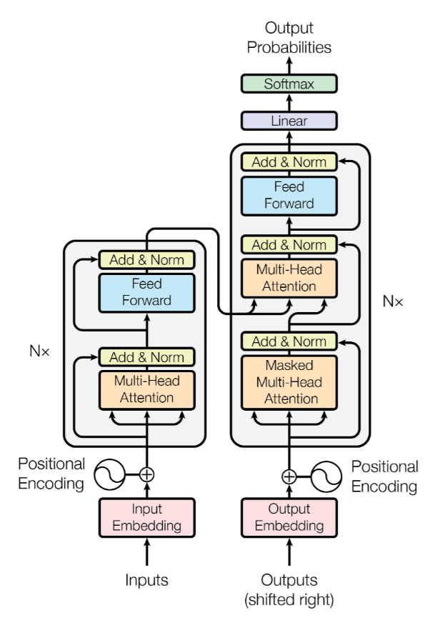
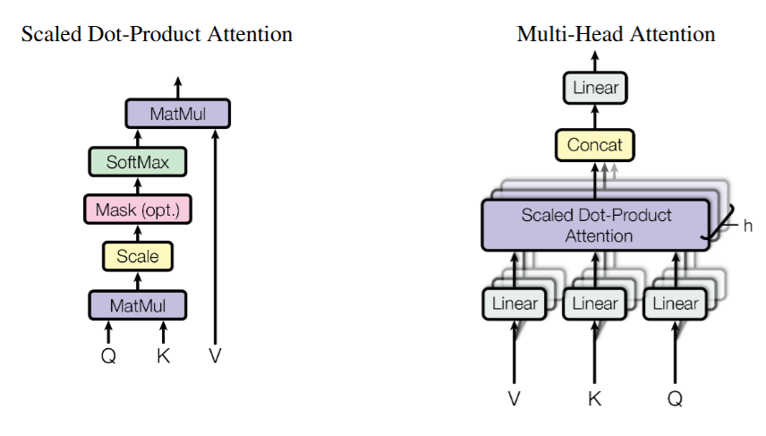
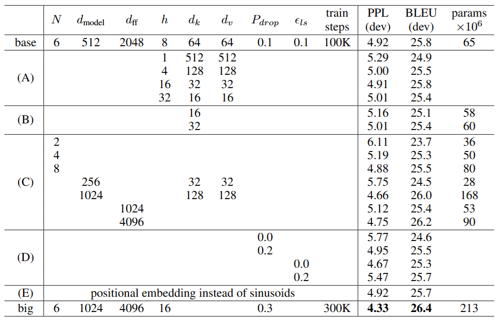
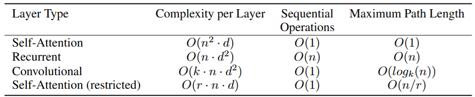
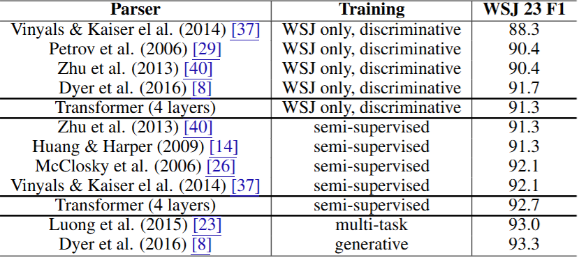

# Attention Is All You Need

## 논문 정보

-   **제목 (Title):** Attention Is All You Need
-   **저자 (Authors) 및 소속 (Affiliations):**
    -   Ashish Vaswani (Google Brain)
    -   Noam Shazeer (Google Brain) 
    -   Niki Parmar (Google Research)
    -   Jakob Uszkoreit (Google Research)
    -   Llion Jones (Google Research)
    -   Aidan N. Gomez (University of Toronto; Work performed while at Google Brain)
    -   Łukasz Kaiser (Google Brain)
    -   Illia Polosukhin (+; Work performed while at Google Research)
-   **학회 또는 저널명 (Conference or Journal Name):** 31st Conference on Neural Information Processing Systems (NIPS 2017), Long Beach, CA, USA
-   **제출일 또는 발행일 (Submission or Publication Date):** 2017년 12월 (NIPS 2017 학회 발표). 이 문서는 2023년 8월 2일자 arXiv:1706.03762v7 버전. 최초 arXiv 제출은 2017년 6월 12일.
-   **키워드 (Keywords):** Transformer, Attention Mechanism, Self-Attention, Multi-Head Attention, Sequence Transduction, Machine Translation, Natural Language Processing, Encoder-Decoder, Parallelization, Positional Encoding

<!-- truncate -->

-   **초록 (Abstract):**
    지배적인 시퀀스 변환 모델은 인코더와 디코더를 포함하는 복잡한 순환 신경망(RNN) 또는 컨볼루션 신경망(CNN)에 기반한다. 최고 성능 모델들은 인코더와 디코더를 어텐션 메커니즘으로 연결한다. 본 논문은 순환과 컨볼루션을 완전히 배제하고 오직 어텐션 메커니즘에만 기반한 새로운 단순한 네트워크 아키텍처인 'Transformer'를 제안한다. 두 가지 기계 번역 작업에 대한 실험 결과, 이 모델들은 품질 면에서 우수하며 병렬화 가능성이 더 높고 훈련 시간이 훨씬 적게 소요됨을 보여준다. WMT 2014 영어-독일어 번역 작업에서 28.4 BLEU를 달성하여 기존 최고 결과(앙상블 포함)를 2 BLEU 이상 개선했다. WMT 2014 영어-프랑스어 번역 작업에서는 8개 GPU에서 3.5일 훈련 후 41.8 BLEU라는 새로운 단일 모델 최고 기록을 세웠으며, 이는 기존 최고 모델들의 훈련 비용의 극히 일부에 해당한다. Transformer는 대규모 및 제한된 훈련 데이터 모두에서 영어 구문 분석 작업에 성공적으로 적용되어 다른 작업에도 잘 일반화됨을 보여준다.
-   **주요 연구 내용 (Main Research Content/Methodology):**

    -   순환 신경망(RNN)과 컨볼루션 신경망(CNN)을 사용하지 않고, 전적으로 어텐션 메커니즘에 기반한 'Transformer'라는 새로운 시퀀스 변환 모델 아키텍처를 제안

    -   인코더-디코더 구조를 가지며, 각 인코더와 디코더는 여러 개의 동일한 레이어를 쌓아 구성
    -   각 레이어는 '멀티헤드 셀프 어텐션(Multi-Head Self-Attention)' 메커니즘과 '위치별 피드포워드 네트워크(Position-wise Feed-Forward Network)'라는 두 개의 주요 하위 레이어로 구성
    -   '스케일드 닷 프로덕트 어텐션(Scaled Dot-Product Attention)'을 기본 어텐션 함수로 사용
    -   여러 어텐션 헤드를 병렬로 사용하여 서로 다른 표현 부분 공간(representation subspaces)에서 정보를 동시에 처리하는 '멀티헤드 어텐션(Multi-Head Attention)' 개념을 도입
    -   입력 시퀀스의 토큰 순서 정보를 모델에 제공하기 위해 사인(sine)과 코사인(cosine) 함수를 사용한 '위치 인코딩(Positional Encoding)'을 입력 임베딩에 추가
    -   레이어 정규화(Layer Normalization)와 잔차 연결(Residual Connections)을 각 하위 레이어에 적용

-   **주요 결과 및 결론 (Key Findings and Conclusion):**
    -   Transformer 모델은 WMT 2014 영어-독일어 번역 작업에서 28.4 BLEU 점수를 획득하여 기존 최고 성능 모델들을 능가
    -   WMT 2014 영어-프랑스어 번역 작업에서 단일 모델로 41.8 BLEU 점수를 기록하며 새로운 최고 수준(state-of-the-art)을 달성 
    -   기존 RNN이나 CNN 기반 모델에 비해 훈련 시간을 크게 단축시키면서도 우수한 번역 품질을 달성하여 병렬화 효율성을 입증
    -   영어 구문 분석(English constituency parsing) 작업에서도 우수한 성능을 보여, Transformer가 기계 번역 외의 다른 자연어 처리 작업에도 효과적으로 일반화될 수 있음을 시사
    -   어텐션 메커니즘만으로도 시퀀스 변환 작업에서 최고 수준의 성능을 달성할 수 있음을 보여주었으며, 이는 순환 계층이 반드시 필요하지 않음을 의미
-   **기여점 (Contributions):**
    -   순환(recurrence)을 완전히 배제하고 전적으로 어텐션(attention)에만 의존하는 최초의 시퀀스 변환 모델인 Transformer(Transformer)를 제안
    -   단일 시퀀스 내의 다른 위치 간의 의존성을 포착하는 셀프 어텐션(self-attention)과, 여러 어텐션을 병렬로 실행하여 다양한 측면의 정보를 학습하는 멀티헤드 어텐션(multi-head attention) 개념을 도입하고 그 효과를 입증
    -   기존 모델들보다 병렬 처리가 용이하여 훈련 시간을 크게 단축시키면서도 번역 품질을 향상시킴으로써 자연어 처리 모델링의 새로운 패러다임을 제시
    -   Transformer 아키텍처는 이후 BERT, GPT 등 수많은 첨단 자연어 처리 모델의 기반이 되었다.
-   **DOI (Digital Object Identifier):** [https://doi.org/10.48550/arXiv.1706.03762](https://doi.org/10.48550/arXiv.1706.03762) (arXiv preprint)
-   **기타 식별 가능한 정보 (예: 연구 분야, 인용 정보 간략 언급 등):**
    -   연구 분야: 자연어 처리 (Natural Language Processing, NLP), 기계 번역 (Machine Translation, MT), 딥러닝 (Deep Learning)
    -   인용 정보: 본 논문은 2017년 NIPS 학회에 발표되었으며, 제시된 Transformer 모델은 이후 자연어 처리 분야 연구에 지대한 영향을 미쳐 광범위하게 인용되고 발전되었음. 제공된 PDF는 2023년 8월 2일자 arXiv 버전 7임.

## 요약

### 서론 (Introduction)

기존의 주요 시퀀스 모델링 및 변환 문제(예: 언어 모델링, 기계 번역)는 주로 순환 신경망(RNN)인 LSTM(Long Short-Term Memory)이나 GRU(Gated Recurrent Unit)를 기반으로 해결되어 왔다. 이러한 순환 모델은 입력 및 출력 시퀀스의 심볼 위치에 따라 계산을 순차적으로 수행한다. 즉, $t$ 시점의 은닉 상태 $h_t$는 이전 시점의 은닉 상태 $h_{t-1}$과 현재 입력에 따라 결정된다. 이러한 본질적인 순차성은 훈련 예제 내에서의 병렬화를 불가능하게 만들어, 특히 시퀀스 길이가 길어질수록 메모리 제약으로 인해 예제 간 배치 처리가 제한되는 치명적인 단점이 된다.

어텐션 메커니즘은 입력 또는 출력 시퀀스 내 거리와 관계없이 의존성을 모델링할 수 있게 해주어 다양한 작업에서 중요한 요소로 자리 잡았다. 그러나 대부분의 경우 이러한 어텐션 메커니즘은 순환 네트워크와 함께 사용되었다.

본 논문에서는 순환(recurrence)을 완전히 배제하고 대신 어텐션 메커니즘에만 전적으로 의존하여 입력과 출력 간의 전역적인 의존성을 포착하는 새로운 모델 아키텍처인 'Transformer(Transformer)'를 제안한다. Transformer는 훨씬 더 많은 병렬화를 허용하며, 8개의 P100 GPU에서 12시간 정도의 짧은 훈련만으로도 번역 품질에서 새로운 최고 수준(state-of-the-art)에 도달할 수 있다.

### 배경 (Background)

순차적 계산을 줄이려는 목표는 Extended Neural GPU, ByteNet, ConvS2S 등의 연구에서도 나타났다. 이들은 모두 컨볼루션 신경망(CNN)을 기본 구성 요소로 사용하여 모든 입출력 위치에 대한 은닉 표현을 병렬로 계산한다. 그러나 이러한 모델들에서 임의의 두 입출력 위치 간의 신호를 연관시키기 위해 필요한 연산 횟수는 위치 간 거리에 따라 선형적(ConvS2S) 또는 로그적(ByteNet)으로 증가한다. 이는 원거리 의존성 학습을 더 어렵게 만든다. Transformer에서는 이 연산 횟수를 상수로 줄였지만, 어텐션 가중 평균으로 인한 유효 해상도 감소라는 비용이 발생할 수 있으며, 이는 본 논문에서 제안하는 멀티헤드 어텐션(Multi-Head Attention)으로 완화된다.

셀프 어텐션(Self-attention), 또는 내부 어텐션(intra-attention)은 단일 시퀀스 내의 서로 다른 위치들을 연관시켜 시퀀스 자체의 표현을 계산하는 어텐션 메커니즘이다. 셀프 어텐션은 독해, 요약, 텍스트 함의, 문장 표현 학습 등 다양한 작업에 성공적으로 사용되어 왔다.

본 논문이 알기로, Transformer는 시퀀스 정렬 RNN이나 컨볼루션 없이 오직 셀프 어텐션에만 의존하여 입력과 출력의 표현을 계산하는 최초의 변환(transduction) 모델이다.

### 모델 아키텍처 (Model Architecture)

대부분의 경쟁력 있는 신경망 시퀀스 변환 모델은 인코더-디코더 구조를 가진다. 인코더는 심볼 표현의 입력 시퀀스 $(x_1, ..., x_n)$을 연속적인 표현 시퀀스 $z = (z_1, ..., z_n)$으로 매핑한다. 주어진 $z$에 대해 디코더는 한 번에 하나씩 심볼의 출력 시퀀스 $(y_1, ..., y_m)$을 생성한다. 각 단계에서 모델은 자기 회귀적(auto-regressive)이며, 이전에 생성된 심볼을 다음 심볼 생성 시 추가 입력으로 사용한다.

Transformer는 이러한 전체적인 아키텍처를 따르며, 인코더와 디코더 모두에 스택형 셀프 어텐션(stacked self-attention)과 점별(point-wise) 완전 연결 계층(fully connected layers)을 사용한다(Figure 1 참고).

**인코더 (Encoder):**
인코더는 $N=6$개의 동일한 레이어로 구성된 스택이다. 각 레이어는 두 개의 하위 레이어(sub-layer)를 가진다. 첫 번째는 멀티헤드 셀프 어텐션 메커니즘이고, 두 번째는 간단한 위치별 완전 연결 피드포워드 네트워크다. 각 하위 레이어 주위에 잔차 연결(residual connection)을 사용하고, 그 뒤에 계층 정규화(layer normalization)를 적용한다. 즉, 각 하위 레이어의 출력은 $LayerNorm(x + Sublayer(x))$이며, 여기서 $Sublayer(x)$는 하위 레이어 자체에 의해 구현된 함수다. 이러한 잔차 연결을 용이하게 하기 위해 모델의 모든 하위 레이어와 임베딩 레이어는 $d_{model}=512$ 차원의 출력을 생성한다.

**디코더 (Decoder):**
디코더 또한 $N=6$개의 동일한 레이어로 구성된 스택이다. 각 인코더 레이어의 두 하위 레이어 외에, 디코더는 인코더 스택의 출력에 대해 멀티헤드 어텐션을 수행하는 세 번째 하위 레이어를 삽입한다. 인코더와 유사하게 각 하위 레이어 주위에 잔차 연결을 사용하고 그 뒤에 계층 정규화를 적용한다. 또한 디코더 스택의 셀프 어텐션 하위 레이어를 수정하여 현재 위치가 다음 위치들을 참조하지 못하게 한다. 이러한 마스킹(masking)은 출력 임베딩이 한 위치씩 오프셋된다는 사실과 결합되어, 위치 $i$에 대한 예측이 위치 $i$보다 작은 위치의 알려진 출력에만 의존하게 보장한다.

**어텐션 (Attention):**
어텐션 함수는 쿼리(query)와 일련의 키-값 쌍(key-value pair)을 출력에 매핑하는 것으로 설명 가능하다. 여기서 쿼리, 키, 값, 출력은 모두 벡터다. 출력은 값들의 가중 합으로 계산되며, 각 값에 할당된 가중치는 쿼리와 해당 키의 호환성 함수(compatibility function)에 의해 계산된다.

-   **스케일드 닷 프로덕트 어텐션 (Scaled Dot-Product Attention):**
    본 논문에서는 이를 "스케일드 닷 프로덕트 어텐션"이라고 부른다(Figure 2 참고). 입력은 $d_k$ 차원의 쿼리와 키, 그리고 $d_v$ 차원의 값으로 구성된다. 쿼리와 모든 키의 닷 프로덕트를 계산하고, 각각을 $\sqrt{d_k}$로 나눈 다음, 소프트맥스(softmax) 함수를 적용하여 값에 대한 가중치를 얻는다. 실제로는 쿼리 집합을 행렬 $Q$로 묶어 동시에 어텐션 함수를 계산한다. 키와 값도 행렬 $K$와 $V$로 묶는다. 출력 행렬은 다음과 같이 계산된다: $Attention(Q, K, V) = softmax(\frac{QK^T}{\sqrt{d_k}})V$ 
    가장 일반적으로 사용되는 두 가지 어텐션 함수는 덧셈적 어텐션(additive attention)과 닷 프로덕트(곱셈적) 어텐션이다. 닷 프로덕트 어텐션은 스케일링 인자 $\frac{1}{\sqrt{d_k}}$를 제외하면 본 논문의 알고리즘과 동일하다. 덧셈적 어텐션은 단일 은닉 계층을 가진 피드포워드 네트워크를 사용하여 호환성 함수를 계산한다. 이론적 복잡도는 비슷하지만, 고도로 최적화된 행렬 곱셈 코드를 사용하여 구현할 수 있으므로 닷 프로덕트 어텐션이 실제로는 훨씬 빠르고 공간 효율적이다. $d_k$ 값이 작을 때는 두 메커니즘이 유사하게 수행되지만, $d_k$가 클 경우 스케일링 없는 닷 프로덕트 어텐션보다 덧셈적 어텐션이 더 나은 성능을 보인다. 이는 큰 $d_k$ 값에 대해 닷 프로덕트 값이 너무 커져 소프트맥스 함수가 기울기가 매우 작은 영역으로 밀려나기 때문이라고 추측되며, 이를 완화하기 위해 닷 프로덕트를 $\frac{1}{\sqrt{d_k}}$로 스케일링한다. 

-   **멀티헤드 어텐션 (Multi-Head Attention):**
    $d_{model}$ 차원의 키, 값, 쿼리로 단일 어텐션 함수를 수행하는 대신, 쿼리, 키, 값을 서로 다른 학습된 선형 투영(linear projection)을 통해 $h$번 각각 $d_k, d_k, d_v$ 차원으로 투영하는 것이 유익하다는 것을 발견했다. 이 투영된 버전의 쿼리, 키, 값 각각에 대해 병렬로 어텐션 함수를 수행하여 $d_v$ 차원의 출력 값을 얻는다. 이들은 연결(concatenate)된 후 다시 한 번 투영되어 최종 값을 생성한다(Figure 2 참고).
    멀티헤드 어텐션은 모델이 서로 다른 위치에서 서로 다른 표현 하위 공간(representation subspaces)의 정보에 공동으로 주의를 기울일 수 있도록 한다(이를 쉽게 비유하기 위해 복잡한 사건을 여러명의 탐정이 수사하는 상황으로 대치해보면 각 탐정_attention head_은 자기 전문 분야_representation subspaces_를 활용하여 단서를 분석하여 모든 탐정의 분석 결과를 종합해 사건 전모를 파악하는 것이라고 생각하면 쉽다.). 단일 어텐션 헤드에서는 평균화가 이를 저해한다.
    $$MultiHead(Q, K, V) = Concat(head_1, ..., head_h)W^O$$
    $$where \quad head_i = Attention(QW_i^Q, KW_i^K, VW_i^V)$$
    여기서 투영은 파라미터 행렬 $W_i^Q \in \mathbb{R}^{d_{model} \times d_k}$, $W_i^K \in \mathbb{R}^{d_{model} \times d_k}$, $W_i^V \in \mathbb{R}^{d_{model} \times d_v}$ 및 $W^O \in \mathbb{R}^{hd_v \times d_{model}}$이다.
    본 연구에서는 $h=8$개의 병렬 어텐션 레이어, 즉 헤드를 사용한다. 각 헤드에 대해 $d_k = d_v = d_{model}/h = 64$를 사용한다. 각 헤드의 차원이 줄어들기 때문에 총 계산 비용은 전체 차원의 단일 헤드 어텐션과 유사하다.

-   **모델에서의 어텐션 적용 (Applications of Attention in our Model):**
    Transformer는 멀티헤드 어텐션을 세 가지 다른 방식으로 사용한다:
    1.  **인코더-디코더 어텐션 레이어:** 쿼리는 이전 디코더 레이어에서 오고, 메모리 키와 값은 인코더의 출력에서 온다. 이를 통해 디코더의 모든 위치가 입력 시퀀스의 모든 위치를 참조할 수 있다.
    2.  **인코더 셀프 어텐션 레이어:** 모든 키, 값, 쿼리는 동일한 출처, 즉 인코더의 이전 레이어 출력에서 온다. 인코더의 각 위치는 인코더의 이전 레이어 모든 위치를 참조할 수 있다.
    3.  **디코더 셀프 어텐션 레이어 (마스크됨):** 유사하게, 디코더의 셀프 어텐션 레이어는 디코더의 각 위치가 해당 위치까지 포함하여 디코더의 모든 위치를 참조할 수 있다. 자기 회귀 속성(auto-regressive property)을 보존하기 위해 디코더에서 왼쪽으로의 정보 흐름을 방지한다. 이는 스케일드 닷 프로덕트 어텐션 내부에서 불법적인 연결에 해당하는 소프트맥스 입력 값을 마스킹(음의 무한대로 설정)하여 구현한다.

**위치별 피드포워드 네트워크 (Position-wise Feed-Forward Networks):**
어텐션 하위 레이어 외에도, 인코더와 디코더의 각 레이어는 완전 연결 피드포워드 네트워크를 포함하며, 이는 각 위치에 개별적으로 그리고 동일하게 적용된다. 이는 두 개의 선형 변환과 그 사이에 ReLU 활성화 함수로 구성된다:
$$FFN(x) = max(0, xW_1 + b_1)W_2 + b_2$$
선형 변환은 서로 다른 위치에서 동일하지만 레이어마다 다른 파라미터를 사용한다. 다른 방식으로 설명하면 커널 크기가 1인 두 개의 컨볼루션과 같다. 입력 및 출력 차원은 $d_{model}=512$이고, 내부 레이어의 차원은 $d_{ff}=2048$이다.

**임베딩과 소프트맥스 (Embeddings and Softmax):**
다른 시퀀스 변환 모델과 유사하게, 학습된 임베딩을 사용하여 입력 토큰과 출력 토큰을 $d_{model}$ 차원의 벡터로 변환한다. 또한 일반적인 학습된 선형 변환과 소프트맥스 함수를 사용하여 디코더 출력을 예측된 다음 토큰 확률로 변환한다. 본 모델에서는 두 임베딩 레이어와 사전 소프트맥스(pre-softmax) 선형 변환 간에 동일한 가중치 행렬을 공유하며, 임베딩 레이어에서는 이러한 가중치에 $\sqrt{d_{model}}$을 곱한다.

**위치 인코딩 (Positional Encoding):**
모델에 순환이나 컨볼루션이 없기 때문에 시퀀스의 순서를 활용하려면 토큰의 상대적 또는 절대적 위치에 대한 정보를 주입해야 한다. 이를 위해 인코더 및 디코더 스택의 맨 아래 입력 임베딩에 "위치 인코딩(positional encodings)"을 추가한다. 위치 인코딩은 임베딩과 동일한 차원 $d_{model}$을 가지므로 두 가지를 합산할 수 있다. 학습된 위치 인코딩과 고정된 위치 인코딩 등 다양한 선택지가 있다.
본 연구에서는 서로 다른 주파수의 사인 및 코사인 함수를 사용한다:
$$PE_{(pos, 2i)} = sin(pos/10000^{2i/d_{model}})$$
$$PE_{(pos, 2i+1)} = cos(pos/10000^{2i/d_{model}})$$
여기서 $pos$는 위치이고 $i$는 차원이다. 즉, 위치 인코딩의 각 차원은 사인파에 해당된다. 파장은 $2\pi$에서 $10000 \cdot 2\pi$까지 기하급수적으로 형성된다. 이 함수를 선택한 이유는 고정된 오프셋 $k$에 대해 $PE_{pos+k}$가 $PE_{pos}$의 선형 함수로 표현될 수 있어 모델이 상대적 위치에 의해 쉽게 어텐션을 학습할 수 있을 것이라고 가정했기 때문이다. 학습된 위치 임베딩을 사용하는 실험도 진행했으며, 두 버전이 거의 동일한 결과를 산출함을 발견했다(Table 3, 행 (E) 참조). 사인파 버전을 선택한 이유는 훈련 중에 접한 것보다 긴 시퀀스 길이에 모델이 일반화될 수 있기 때문이다.

### 왜 셀프 어텐션인가? (Why Self-Attention?)

이 섹션에서는 셀프 어텐션 레이어의 다양한 측면을, 가변 길이 심볼 표현 시퀀스 $(x_1, ..., x_n)$을 동일 길이의 다른 시퀀스 $(z_1, ..., z_n)$ (여기서 $x_i, z_i \in \mathbb{R}^d$)로 매핑하는 데 일반적으로 사용되는 순환 및 컨볼루션 레이어와 비교한다. 셀프 어텐션 사용을 정당화하기 위해 세 가지 바람직한 특성을 고려한다.

첫째는 레이어당 총 계산 복잡도다. 둘째는 병렬화할 수 있는 계산량이며 필요한 최소 순차 연산 수로 측정된다. 셋째는 네트워크 내 장거리 의존성 간의 경로 길이다. 장거리 의존성을 학습하는 것은 많은 시퀀스 변환 작업에서 핵심적인 과제이다. 이러한 의존성 학습 능력에 영향을 미치는 한 가지 주요 요인은 네트워크에서 순방향 및 역방향 신호가 통과해야 하는 경로의 길이다. 입력 및 출력 시퀀스의 모든 위치 조합 간 경로가 짧을수록 장거리 의존성을 학습하기가 더 쉽다. 따라서 서로 다른 레이어 유형으로 구성된 네트워크에서 임의의 두 입력 및 출력 위치 간의 최대 경로 길이도 비교한다.

Table 1에서 볼 수 있듯이, 셀프 어텐션 레이어는 일정한 수의 순차적으로 실행되는 연산으로 모든 위치를 연결하는 반면, 순환 레이어는 $O(n)$의 순차 연산이 필요하다. 계산 복잡도 측면에서, 시퀀스 길이 $n$이 표현 차원 $d$보다 작을 때 셀프 어텐션 레이어가 순환 레이어보다 빠르며, 이는 최신 기계 번역 모델에서 사용되는 문장 표현(예: word-piece 및 byte-pair 표현)의 경우 대부분 해당된다. 매우 긴 시퀀스를 포함하는 작업의 계산 성능을 향상시키기 위해, 셀프 어텐션은 해당 출력 위치를 중심으로 입력 시퀀스에서 크기 $r$의 이웃만 고려하도록 제한될 수 있다. 이렇게 하면 최대 경로 길이가 $O(n/r)$로 증가한다.

커널 너비 $k < n$인 단일 컨볼루션 레이어는 모든 입력 및 출력 위치 쌍을 연결하지 않는다. 이를 위해서는 연속적인 커널의 경우 $O(n/k)$개의 컨볼루션 레이어 스택이 필요하거나, 확장 컨볼루션(dilated convolutions)의 경우 $O(log_k(n))$이 필요하며, 이는 네트워크에서 임의의 두 위치 간 가장 긴 경로의 길이를 증가시킨다. 컨볼루션 레이어는 일반적으로 순환 레이어보다 $k$배 더 비싸다. 그러나 분리 가능한 컨볼루션(separable convolutions)은 복잡도를 $O(k \cdot n \cdot d + n \cdot d^2)$로 상당히 줄인다. $k=n$인 경우에도 분리 가능한 컨볼루션의 복잡도는 셀프 어텐션 레이어와 점별 피드포워드 레이어의 조합과 동일하며, 이것이 Transformer 모델에서 취하는 접근 방식이다.

부가적인 이점으로, 셀프 어텐션은 더 해석 가능한 모델을 산출할 수 있다. 개별 어텐션 헤드가 명확하게 다른 작업을 학습할 뿐만 아니라, 많은 헤드가 문장의 구문 및 의미 구조와 관련된 행동을 보이는 것으로 나타난다.

### 훈련 (Training)

이 섹션에서는 모델의 훈련 방식을 설명한다.

**훈련 데이터 및 배치 (Training Data and Batching):**
약 450만 개의 문장 쌍으로 구성된 표준 WMT 2014 영어-독일어 데이터셋으로 훈련했다. 문장은 바이트 쌍 인코딩(byte-pair encoding, BPE) 을 사용하여 인코딩되었으며, 이는 약 37,000개의 토큰으로 구성된 공유 소스-타겟 어휘를 가진다. 영어-프랑스어의 경우, 3,600만 개의 문장으로 구성된 훨씬 더 큰 WMT 2014 영어-프랑스어 데이터셋을 사용했으며 토큰을 32,000개의 단어 조각(word-piece) 어휘 로 분할했다. 문장 쌍은 대략적인 시퀀스 길이에 따라 함께 배치되었다. 각 훈련 배치에는 대략 25,000개의 소스 토큰과 25,000개의 타겟 토큰을 포함하는 문장 쌍 세트가 포함되었다. 

**하드웨어 및 일정 (Hardware and Schedule):**
8개의 NVIDIA P100 GPU가 장착된 단일 시스템에서 모델을 훈련했다. 논문 전반에 설명된 하이퍼파라미터를 사용하는 기본 모델의 경우, 각 훈련 단계는 약 0.4초가 걸렸다. 기본 모델을 총 100,000단계 또는 12시간 동안 훈련했다. 대형 모델(Table 3의 맨 아래 줄에 설명됨)의 경우 단계 시간은 1.0초였다. 대형 모델은 300,000단계(3.5일) 동안 훈련되었다.

**옵티마이저 (Optimizer):**
Adam 옵티마이저를 $\beta_1=0.9, \beta_2=0.98, \epsilon=10^{-9}$로 사용했다. 다음 공식에 따라 훈련 과정에서 학습률을 변경했다:
$$lrate = d_{model}^{-0.5} \cdot min(step\_num^{-0.5}, step\_num \cdot warmup\_steps^{-1.5})$$
이는 첫 $warmup\_steps$ 훈련 단계 동안 학습률을 선형적으로 증가시키고, 그 이후에는 단계 수의 역제곱근에 비례하여 감소시키는 것에 해당한다.  $warmup\_steps = 4000$을 사용했다.

**정규화 (Regularization):**
훈련 중 세 가지 유형의 정규화를 사용한다:

-   **잔차 드롭아웃 (Residual Dropout):** 각 하위 레이어의 출력에 드롭아웃을 적용한 후, 하위 레이어 입력에 더하고 정규화한다. 또한, 인코더와 디코더 스택 모두에서 임베딩과 위치 인코딩의 합계에도 드롭아웃을 적용한다. 기본 모델의 경우 $P_{drop}=0.1$ 비율을 사용한다.
-   **레이블 스무딩 (Label Smoothing):** 훈련 중 $\epsilon_{ls}=0.1$값의 레이블 스무딩을 사용했다. 이는 모델이 더 불확실해지도록 학습하므로 퍼플렉서티(perplexity)에는 부정적이지만, 정확도와 BLEU 점수를 향상시킨다.

### 결과 (Results)

**기계 번역 (Machine Translation):**
WMT 2014 영어-독일어 번역 작업에서, 대형 Transformer 모델(Table 2의 Transformer (big))은 이전에 보고된 최고 모델(앙상블 포함)보다 2.0 BLEU 이상 뛰어난 성능을 보여 28.4라는 새로운 최고 BLEU 점수를 기록했다. Transformer (big) 모델의 구성은 Table 3의 맨 아래 줄에 나열됐다. 훈련에는 8개의 P100 GPU에서 3.5일이 소요됐다. 기본 모델조차도 경쟁 모델들의 훈련 비용의 일부만으로 이전에 발표된 모든 모델과 앙상블을 능가한다.

WMT 2014 영어-프랑스어 번역 작업에서, 대형 모델은 41.8 BLEU 점수(Abstract 및 Table 2 기준)를 달성하여 이전에 발표된 모든 단일 모델을 능가했으며, 이전 최고 모델 훈련 비용의 1/4 미만이다. 영어-프랑스어용으로 훈련된 Transformer (big) 모델은 드롭아웃 비율 $P_{drop}=0.1$을 사용했다(0.3 대신). 

기본 모델의 경우, 10분 간격으로 작성된 마지막 5개 체크포인트를 평균하여 얻은 단일 모델을 사용했다. 대형 모델의 경우 마지막 20개 체크포인트를 평균냈다. 빔 크기 4와 길이 페널티 $\alpha=0.6$을 사용한 빔 검색을 사용했다. 이러한 하이퍼파라미터는 개발 세트에서의 실험 후 선택됐다. 추론 중 최대 출력 길이는 입력 길이 + 50으로 설정했지만, 가능할 때 조기 종료했다.

Table 2는 결과를 요약하고 번역 품질과 훈련 비용을 문헌의 다른 모델 아키텍처와 비교한다. 모델 훈련에 사용된 부동 소수점 연산 횟수는 훈련 시간, 사용된 GPU 수, 각 GPU의 지속적인 단정밀도 부동 소수점 용량 추정치를 곱하여 추정한다.

**모델 변형 (Model Variations):**
Transformer의 여러 구성 요소의 중요성을 평가하기 위해 기본 모델을 다양한 방식으로 변경하고, 영어-독일어 번역 개발 세트(newstest2013)에서 성능 변화를 측정했다. 이전 섹션에서 설명한 대로 빔 검색을 사용했지만 체크포인트 평균화는 사용하지 않았다. 이러한 결과는 Table 3에 제시되어 있다.

-   Table 3의 행 (A)에서는 섹션 3.2.2에서 설명한 대로 계산량을 일정하게 유지하면서 어텐션 헤드 수와 어텐션 키 및 값 차원을 변경한다. 단일 헤드 어텐션은 최고 설정보다 0.9 BLEU 낮지만, 헤드가 너무 많아도 품질이 떨어진다.
-   Table 3의 행 (B)에서는 어텐션 키 크기 $d_k$를 줄이면 모델 품질이 저하됨을 관찰했다. 이는 호환성을 결정하는 것이 쉽지 않으며 닷 프로덕트보다 더 정교한 호환성 함수가 유익할 수 있음을 시사한다.
-   행 (C)와 (D)에서는 예상대로 더 큰 모델이 더 좋고, 드롭아웃이 과적합을 피하는 데 매우 도움이 됨을 관찰한다.
-   행 (E)에서는 사인파 위치 인코딩을 학습된 위치 임베딩으로 대체하고 기본 모델과 거의 동일한 결과를 관찰한다.

**영어 구문 분석 (English Constituency Parsing):**
Transformer가 다른 작업으로 일반화될 수 있는지 평가하기 위해 영어 구문 분석에 대한 실험을 수행했다. 이 작업은 특정 과제를 제시한다: 출력은 강력한 구조적 제약을 받으며 입력보다 훨씬 길다.  더욱이 RNN 시퀀스-투-시퀀스 모델은 소규모 데이터 체제에서 최고 수준의 결과를 달성하지 못했다.

Penn Treebank의 Wall Street Journal (WSJ) 부분(약 40,000개의 훈련 문장)에서 $d_{model}=1024$인 4계층 Transformer를 훈련했다. 또한 약 1,700만 개의 문장이 있는 더 큰 고신뢰도 및 Berkley Parser 말뭉치를 사용하는 준지도 학습 환경에서도 훈련했다. WSJ 전용 설정에는 16,000개 토큰 어휘를, 준지도 학습 설정에는 32,000개 토큰 어휘를 사용했다.

섹션 22 개발 세트에서 드롭아웃(어텐션 및 잔차 모두, 섹션 5.4), 학습률, 빔 크기를 선택하기 위해 소수의 실험만 수행했으며, 다른 모든 매개변수는 영어-독일어 기본 번역 모델에서 변경되지 않았다. 추론 중 최대 출력 길이를 입력 길이 + 300으로 늘렸다. WSJ 전용 및 준지도 학습 설정 모두에 빔 크기 21과 $\alpha=0.3$을 사용했다.

Table 4의 결과는 작업별 튜닝이 부족함에도 불구하고 Transformer 모델이 놀랍도록 잘 수행되어 Recurrent Neural Network Grammar를 제외한 이전에 보고된 모든 모델보다 더 나은 결과를 산출한다. NN 시퀀스-투-시퀀스 모델과 대조적으로, Transformer는 40,000개의 문장으로 구성된 WSJ 훈련 세트에서만 훈련했을 때도 BerkeleyParser보다 뛰어난 성능을 보인다.

### 결론 (Conclusion)

본 연구에서는 인코더-디코더 아키텍처에서 가장 일반적으로 사용되는 순환 계층을 멀티헤드 셀프 어텐션으로 대체하여, 전적으로 어텐션에 기반한 최초의 시퀀스 변환 모델인 Transformer를 제시했다.

번역 작업의 경우, Transformer는 순환 또는 컨볼루션 계층에 기반한 아키텍처보다 훨씬 빠르게 훈련될 수 있다. WMT 2014 영어-독일어 및 WMT 2014 영어-프랑스어 번역 작업 모두에서 새로운 최고 수준을 달성했다. 전자의 작업에서는 Transformer의 최고 모델이 이전에 보고된 모든 앙상블조차 능가했다.

이 연구진의 향후 계획은 어텐션 기반 모델의 미래에 대해 기대하며 다른 작업에 적용하는 것이다. Transformer를 텍스트 이외의 입력 및 출력 양상(예: 이미지, 오디오, 비디오)을 포함하는 문제로 확장하고, 이미지, 오디오, 비디오와 같은 대규모 입력 및 출력을 효율적으로 처리하기 위한 로컬, 제한된 어텐션 메커니즘을 연구할 계획이다. 생성을 비교적 덜 순차적으로 만드는 것도 이 연구진의 또 다른 연구 목표다.

모델 훈련 및 평가에 사용된 코드는 https://github.com/tensorflow/tensor2tensor 에서 확인할 수 있다.